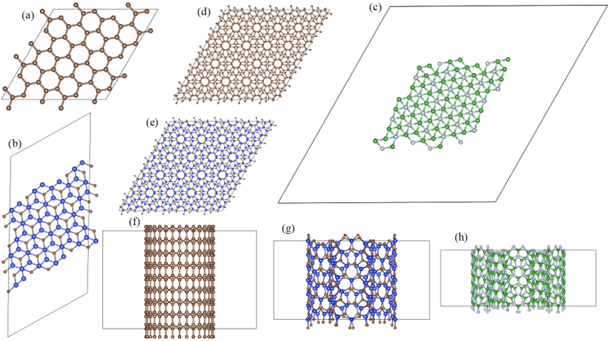

# [NanoStudio: A Python Package for Automated Construction of Twisted Two-Dimensional Materials and Multi-Walled Nanotubes]()

Here, we present NanoStudio, an open-source Python package for the automated construction of low-dimensional nanostructures based on honeycomb lattices. The package provides a unified implementation for generating graphene with arbitrary chirality, multilayer graphene with user-defined stacking sequences, twisted graphene with arbitrary commensurate twist angles, quasi-one-dimensional nanoribbons, and multi-walled nanotubes. 



## Authors

This package was primarily written by Chenglong Qin (clqin@xhu.edu.cn).

## License

The model is released under the MIT License.

## Usage
# h-BN Nanocluster (ABC Stacking) API Documentation
> Document Version: v1.0
> Based on Python + ASE + NumPy
> Supported Structure: ABC-stacked hexagonal Boron Nitride (h-BN) nanocluster

## 1. Project Overview
This module implements **ABC-stacked h-BN nanocluster** construction, extended from the base `Nano` abstract class.

### Supported Features
- Monolayer / multi-layer h-BN cluster generation
- Standard **ABC stacking (rhombohedral h-BN)**
- Custom supercell, vacuum layer and periodic boundary conditions
- Export VASP POSCAR file & 3D visualization via ASE
- Fully compatible with existing graphene / twisted graphene / carbon nanotube framework

### Basic Lattice Parameters
| Parameter | Value | Description |
| :--- | :--- | :--- |
| B-N bond length | 1.45 Å | In-plane covalent bond length |
| In-plane lattice constant | 2.51 Å | Primitive cell lattice parameter |
| Interlayer spacing (ABC) | 3.33 Å | Vertical distance between adjacent layers |
| Atom species | B, N | Alternating arrangement in honeycomb lattice |

### ABC Stacking Rule
- Layer A: `(0.0, 0.0)` fractional shift
- Layer B: `(1/3, 1/3)` fractional shift relative to A
- Layer C: `(-1/3, 2/3)` fractional shift relative to A
- Cycle: `A → B → C → A` for multi-layer structures

## 2. Dependencies
```txt
python >= 3.8
numpy >= 1.21
ase >= 3.22
```

**Installation Command**
```bash
pip install numpy ase
```

## 3. Class Architecture
```
Nano (Base Abstract Class)
├─ Graphene
├─ TwistGraphene
├─ Nanotube
└─ HBN_ABC (ABC-stacked h-BN Nanocluster)
```

## 4. Core Class: HBN_ABC
### 4.1 Class Initialization
```python
class HBN_ABC(Nano):
    def __init__(self, n, m, xy_period=[1, 1], xy_pbc=[True, True], 
                 bond_length=1.45, atom_type=['B', 'N'], vacuum=8.0):
```

#### Input Parameters
| Parameter | Type | Default | Description |
| :--- | :--- | :--- | :--- |
| `n` | `int` | - | Lattice index along lattice vector `a1` |
| `m` | `int` | - | Lattice index along lattice vector `a2` |
| `xy_period` | `list[int]` | `[1, 1]` | Supercell repetition number along x, y |
| `xy_pbc` | `list[bool]` | `[True, True]` | Periodic boundary conditions for x, y axis |
| `bond_length` | `float` | `1.45` | B-N in-plane bond length (unit: Å) |
| `atom_type` | `list[str]` | `['B', 'N']` | Atomic species for h-BN (fixed as B, N) |
| `vacuum` | `float` | `8.0` | Vacuum layer thickness for z direction (unit: Å) |

#### Inherited Internal Attributes
| Attribute | Type | Description |
| :--- | :--- | :--- |
| `origin_n`, `origin_m` | `int` | Original input lattice indices |
| `pbc` | `list[bool]` | 3D PBC: `[x, y, z]`, z is always `False` for clusters |
| `period` | `list` | Supercell repetition for 3 directions |
| `bond_length` | `float` | B-N bond length |
| `vacuum` | `float` | Vacuum layer thickness |

---

### 4.2 Main Method: get_structures()
Generate ABC-stacked h-BN structure and return ASE `Atoms` object.
```python
def get_structures(self, layer_num=3, layer_spacing=3.33):
```

#### Input Parameters
| Parameter | Type | Default | Description |
| :--- | :--- | :--- | :--- |
| `layer_num` | `int` | `3` | Total number of h-BN layers (3 = standard ABC 3-layer) |
| `layer_spacing` | `float` | `3.33` | Vertical interlayer distance (unit: Å) |

#### Built-in Stacking Offset
Automatically assign in-plane shift for each layer (cyclic):
1. Layer A: `(0.0, 0.0)`
2. Layer B: `(1/3, 1/3)`
3. Layer C: `(-1/3, 2/3)`

#### Return Value
- `ase.Atoms`: Standard ASE atomic structure object
  - Support `.write()` to export VASP POSCAR file
  - Support `view()` for 3D structure visualization

---

### 4.3 Auxiliary Method: show_properties()
```python
def show_properties(self, layer_num=3):
```

#### Function
Print formatted structural properties to console via `pprint`.

#### Output Content
- Periodic boundary conditions (PBC)
- Supercell period
- Lattice index `(n, m)`
- B-N bond length
- Total atom number
- Layer count
- Lattice chiral angle

---

### 4.4 Private Core Methods (For Development)
#### 1. _build_coords(translation)
- **Function**: Generate fractional coordinates for single h-BN layer
- **Input**: `translation: tuple[float, float]` — in-plane stacking offset
- **Return**: Numpy array with format `[x, y, z, element]`

#### 2. _get_properties(layer_num)
- **Function**: Calculate lattice matrix, total atoms and structural properties
- **Return**: Dictionary of all structural parameters

#### 3. Inherited from Base Class `Nano`
- `a1a2_to_ij()`: Convert oblique coordinates to Cartesian coordinates
- `extended_gcd()`: Extended Euclidean algorithm for lattice tiling
- `_get_structures()`: Convert coordinate array to standard ASE `Atoms` object

## 5. Structure Description
### 5.1 Lattice Cell
- Cell type: Hexagonal lattice
- 3D cell matrix: Auto-generated by `(n, m)` supercell
- Z direction: Non-periodic + vacuum layer (designed for nanocluster)

### 5.2 Atomic Arrangement
1. Single layer: Honeycomb lattice, **B and N occupy two sublattices alternately**
2. ABC stacking: Follow fixed fractional offsets
3. Vertical direction: Uniform interlayer spacing

### 5.3 Atom Count Rule
```
Total atoms = 2 × atoms_per_layer × layer_num
```
> 2 = Two sublattices (B + N)

## 6. Usage Examples
### 6.1 Standard 3-Layer ABC h-BN Cluster
```python
if __name__ == '__main__':
    # Initialize model
    model = HBN_ABC(n=6, m=6, xy_period=[1,1], xy_pbc=[True,True])
    # Build structure
    hbn_struct = model.get_structures(layer_num=3, layer_spacing=3.33)
    # Print properties
    model.show_properties(layer_num=3)
    # Export VASP file
    hbn_struct.write("hBN_ABC_3layer.vasp", format="vasp")
    # Visualize
    view(hbn_struct)
```

### 6.2 6-Layer Cyclic ABC Stacking
```python
# Stack: A-B-C-A-B-C
model = HBN_ABC(n=8, m=8)
struct = model.get_structures(layer_num=6, layer_spacing=3.33)
struct.write("hBN_ABC_6layer.vasp", format="vasp")
```

### 6.3 Custom Vacuum & Bond Length
```python
# Vacuum = 10 Å, B-N bond = 1.46 Å
model = HBN_ABC(n=5, m=5, bond_length=1.46, vacuum=10.0)
struct = model.get_structures(layer_num=3)
```

## 7. Error Handling & Notes
### 7.1 Common Exceptions
- Shape error: Ensure `n` and `m` are positive integers
- Atom type warning: Do not modify `['B', 'N']` arbitrarily for h-BN

### 7.2 Important Notes
1. Z-direction PBC is permanently disabled for nanocluster.
2. ABC stacking offsets are fixed for standard h-BN, no manual adjustment needed.
3. All length units: **Angstrom (Å)**.
4. Fractional coordinates will be automatically wrapped into `[0, 1)` range.
5. Fully compatible with the original `Nano` class series.

## 8. Changelog
| Version | Date | Update Content |
| :--- | :--- | :--- |
| v1.0 | 2026-06-12 | Initial release for ABC-stacked h-BN nanocluster |

